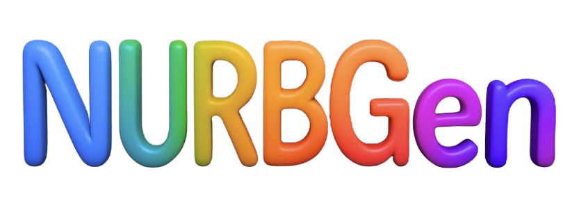

<div align="center">



### High-Fidelity Text-to-CAD Generation through LLM-Driven NURBS Modeling

[](https://ojs.aaai.org/index.php/AAAI/article/view/37922)
[](https://arxiv.org/abs/2511.06194)
[](https://muhammadusama100.github.io/NURBGen/)
[](https://huggingface.co/datasets/SadilKhan/PartABC)
[](https://huggingface.co/SadilKhan/NURBGen)
[](https://mdsadilkhan.onrender.com/publications/data/nurbgen_poster.png)

**The first framework to generate industry-standard NURBS surfaces directly from text prompts,
producing editable, parametric CAD models convertible to STEP format.**

[Muhammad Usama](https://muhammadusama100.github.io/MUsama/)<sup>1,2,3 \*</sup> ·
[Mohammad Sadil Khan](https://mdsadilkhan.onrender.com/)<sup>1,2,3 \* †</sup> ·
[Didier Stricker](https://av.dfki.de/members/stricker/)<sup>1,2</sup> ·
[Muhammad Zeshan Afzal](https://scholar.google.com/citations?user=kHMVj6oAAAAJ&hl=en)<sup>1,3</sup>

<sup>1</sup>DFKI Kaiserslautern &nbsp;·&nbsp; <sup>2</sup>RPTU Kaiserslautern-Landau &nbsp;·&nbsp; <sup>3</sup>MindGauge

<sup>\* Equally contributing first authors &nbsp;·&nbsp; † Corresponding author</sup>

</div>

---

## Release Status
 
| | Component |
|---|---|
| ✅ | Pre-trained Model Weights |
| ✅ | Inference Scripts |
| ✅ | Reconstruction Scripts |
| ⬜ | Training Scripts |
| ⬜ | Data Preparation Scripts |
| ⬜ | PartABC Dataset |
 
---

## How to Use

### 1. Create the environment

```bash
conda env create -f environment.yaml
conda activate nurbgen
```

### 2. Install Flash Attention
 
Flash Attention must be installed from the pre-built wheel **after** the environment is created, as it is tied to your specific CUDA and PyTorch versions:
 
```bash
# https://github.com/Dao-AILab/flash-attention/releases/tag/v2.8.0.post2
pip install flash_attn-2.8.0.post2+cu12torch2.7cxx11abiTRUE-cp311-cp311-linux_x86_64.whl
```
 
> Pre-built wheels for other CUDA/PyTorch combinations are available at [flash-attention releases](https://github.com/Dao-AILab/flash-attention/releases).
> To build from source instead: `pip install flash-attn --no-build-isolation`
 

### Inference (Text-to-CAD Generation) (CLI)


 **CLI Reference**

| Flag | Default | Description |
|---|---|---|
| `--prompt` / `-p` | — | Inline single prompt string |
| `--input` / `-i` | — | Path to `.txt`, `.json`, or `.jsonl` |
| `--output_dir` / `-o` | `./nurbgen_outputs` | Directory for output `.txt` files |
| `--batch_size` | `4` | Prompts per inference batch |
| `--max_new_tokens` | `8192` | Maximum tokens to generate |
| `--temperature` | `0.3` | `0` = greedy decoding |
| `--save_summary` | off | Also write `results_summary.json` |

---

```bash

# For single prompt, use the --prompt flag:
python -n src.infer_nurbgen --prompt "Socket head cap screw with a large countersunk washer. Features a hexagonal socket drive and a cylindrical threaded shank. Dimensions: length 92.96 mm, width 79.38 mm, height 43.66 mm. Ensure smooth curvature at transitions." --output_dir ./results

# For batch processing with file outputs, create a text file (e.g., prompts.txt) with one prompt per line:
python -n src.infer_nurbgen --input prompts.txt --output_dir ./results

# For json input [{"uid", "caption"},{"uid", "caption"}], create a jsonl file (e.g., prompts.jsonl):
python -n src.infer_nurbgen --input prompts.jsonl --output_dir ./results
```

### Python API — ms-swift

```python
from swift.llm import PtEngine, RequestConfig, InferRequest

engine = PtEngine(
    "Qwen/Qwen3-4B",
    adapters=["SadilKhan/NURBGen"],
    use_hf=True,
)

response = engine.infer(
    [InferRequest(messages=[{"role": "user", "content": "Generate NURBS for the following: Design a rectangular plate with dimensions 330.20 mm x 233.40 mm x 6.00 mm. Include two square through-holes near each end."}])],
    request_config=RequestConfig(max_tokens=8192, temperature=0.3),
)
print(response[0].choices[0].message.content)
```

### Python API — HuggingFace / PEFT

```python
import torch
from transformers import AutoTokenizer, AutoModelForCausalLM
from peft import PeftModel

tokenizer = AutoTokenizer.from_pretrained("Qwen/Qwen3-4B")
model = AutoModelForCausalLM.from_pretrained(
    "Qwen/Qwen3-4B", torch_dtype=torch.bfloat16, device_map="auto"
)
model = PeftModel.from_pretrained(model, "SadilKhan/NURBGen")
model.eval()

messages = [{"role": "user", "content": "Generate NURBS for the following: Design a rectangular plate with dimensions 330.20 mm x 233.40 mm x 6.00 mm. Include two square through-holes near each end. "}]
text = tokenizer.apply_chat_template(messages, tokenize=False, add_generation_prompt=True)
inputs = tokenizer(text, return_tensors="pt").to(model.device)

with torch.no_grad():
    outputs = model.generate(**inputs, max_new_tokens=8192, do_sample=False)

print(tokenizer.decode(outputs[0][inputs.input_ids.shape[1]:], skip_special_tokens=True))
```

## Citation

If you find NURBGen useful in your research, please cite:

```bibtex
@inproceedings{usama2026nurbgen,
  title={NURBGen: High-Fidelity Text-to-CAD Generation through LLM-Driven NURBS Modeling},
  author={Usama, Muhammad and Khan, Mohammad Sadil and Stricker, Didier and Afzal, Muhammad Zeshan},
  booktitle={Proceedings of the AAAI Conference on Artificial Intelligence},
  volume={40},
  number={12},
  pages={9603--9611},
  year={2026}
}
```

---

<div align="center">
  <sub>Developed at DFKI Kaiserslautern · MindGarage · RPTU Kaiserslautern-Landau</sub><br>
  <sub>Contact: <a href="mailto:mdsadilkhan99@gmail.com">mdsadilkhan99@gmail.com</a></sub>
</div>